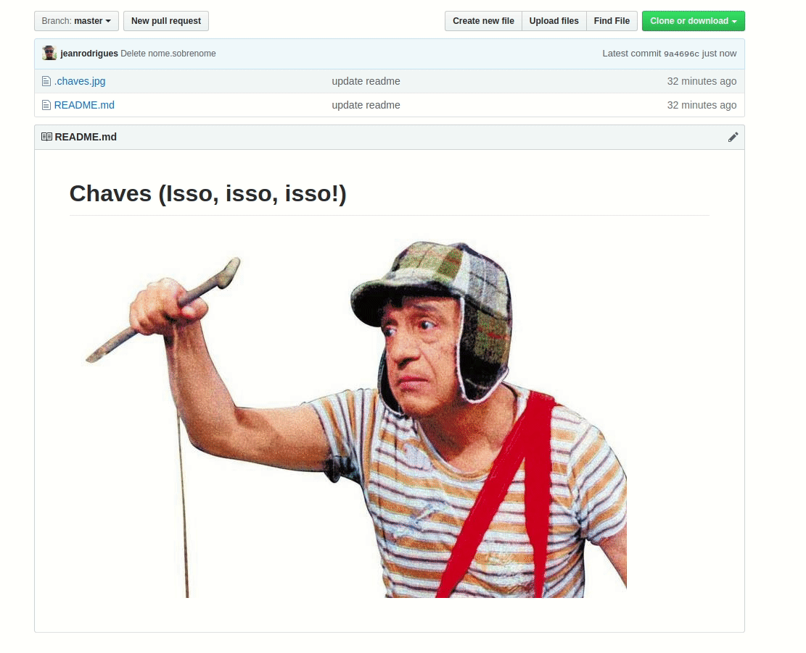

# Chaves (Isso, isso, isso!)

### Localize sua chave publica
1. Abra o terminal (linux/mac)
3. Cole o seguinte comando:

 **`find ~/.ssh -name '*.pub' -exec cat {} \;`**

3. Clique em **`Create new file`** em **`Name your file`** coloque seu **`nome.sobrenome.pub`** e cole a chave do passo anterior depois **`commit`**.

